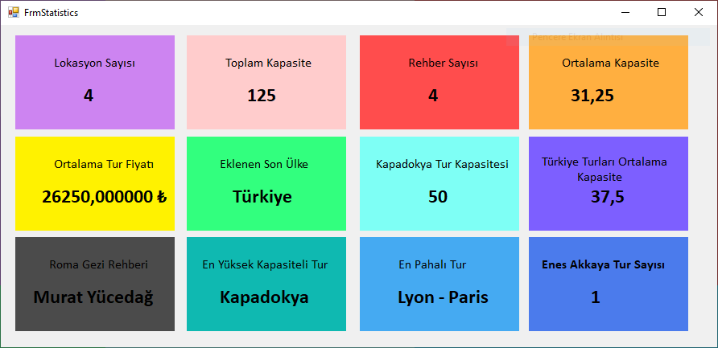

# 🧭 EF Travel Projesi – Seyahat İstatistik Paneli (Entity Framework - Windows Forms)

Bu proje, **Entity Framework** kullanılarak oluşturulmuş bir **seyahat veritabanındaki bilgileri analiz eden** ve **Windows Forms üzerinde istatistikleri görselleştiren** bir uygulamadır.  
Amaç, kullanıcıya veritabanında yer alan **seyahat lokasyonları, rehberler ve kapasiteler** gibi bilgileri görsel olarak sunan dinamik bir panel oluşturmaktır.

---

## 🛠️ Kullanılan Teknolojiler

- **C# (.NET Framework)**
- **Windows Forms**
- **Entity Framework 6 (Database First Yaklaşımı)**
- **SQL Server**
- **LINQ Sorguları**

---

## 📊 Proje Özeti

Bu projede, bir **seyahat acentesi veritabanından** alınan bilgiler analiz edilerek, çeşitli istatistiklerin gösterildiği bir kontrol paneli tasarlanmıştır.  
Windows Forms arayüzü, kullanıcıya **anlık veriler** sunarak uygulamayı daha interaktif hale getirir.

Panelde yer alan bazı istatistikler şunlardır:

| Gösterge | Açıklama |
|-----------|-----------|
| 🌍 **Lokasyon Sayısı** | Veritabanındaki toplam seyahat lokasyonu sayısı |
| 👥 **Toplam Kapasite** | Tüm turların toplam kapasitesi |
| 🧭 **Rehber Sayısı** | Aktif rehberlerin toplam sayısı |
| 📈 **Ortalama Kapasite** | Turların ortalama kapasite değeri |
| 🇹🇷 **Türkiye Turları Ortalama Kapasite** | Yalnızca Türkiye turlarının ortalama kapasitesi |
| 🏜️ **Kapadokya Tur Kapasitesi** | Kapadokya bölgesine ait turların kapasite bilgisi |
| 🏁 **Eklenen Son Ülke** | Veritabanına son eklenen ülke adı |
| 💰 **Ortalama Tur Fiyatı** | Tüm turların ortalama fiyat bilgisi |
| 🧑‍💼 **Belirli Rehbere Ait Tur Sayısı** | Örneğin “Enes Akkaya” rehberine ait tur sayısı |
| 💸 **En Pahalı Tur** | Fiyat olarak en yüksek değere sahip tur |
| 🚌 **En Yüksek Kapasiteli Tur** | En fazla kapasiteye sahip tur bilgisi |
| 🇮🇹 **Roma Gezi Rehberi** | Roma turuna ait rehber bilgisi |

---

## 🧩 Proje Yapısı

CSharpEgitimKampi301.EFProject/
│
├── FrmStatistics.cs → Ana form (istatistik paneli)
├── FrmStatistics.Designer.cs → Panel tasarım kodları
├── EgitimKampiEfTravelDbEntities.edmx → Entity Framework veri modeli
└── App.config → Veritabanı bağlantı ayarları

---

## 📷 Ekran Görüntüsü

Aşağıda, projenin Windows Forms arayüzüne ait örnek bir ekran görüntüsü bulunmaktadır:

> 🎨 Flatuicolors kullanılarak yapılan renkli paneller, her bir istatistik bilgisini ayrı kutularda gösterecek şekilde tasarlanmıştır.  
> Örneğin “Lokasyon Sayısı” mor panelde, “Rehber Sayısı” kırmızı panelde görüntülenir.

---

## ⚙️ Nasıl Çalışır?

1. **Entity Framework** üzerinden `EgitimKampiEfTravelDbEntities` modelini kullanarak veritabanına bağlanılır.  
2. LINQ sorguları yardımıyla ilgili tablolar sorgulanır.  
3. Elde edilen veriler **label** kontrollerine aktarılır.  
4. Her panel, farklı bir istatistik göstergesini temsil eder.

---

## 🎯 Öğrenilen Konular

- Entity Framework Database First yapısının uygulanması  
- LINQ sorguları ile veritabanı sorgulama  
- Windows Forms üzerinde dinamik veri gösterimi  
- Arayüzde renk kodlama ve görsel denge  
- Kodun katmanlı yapıya uygun şekilde düzenlenmesi  

